# B2B Barter Exchange Portal (MERN)

A full-stack B2B barter marketplace built with the MERN stack (MongoDB, Express.js, React.js, Node.js). This platform allows businesses to list surplus inventory and propose trade deals without direct monetary transactions.

## 🚀 Features

- **User Authentication**: Secure Login/Register with JWT and Role-Based Access Control (RBAC).
- **Inventory Management**: Create, Read, Update, and Delete (CRUD) listings with image support.
- **Marketplace**: Browse and search listings with filtering (Category, Search text).
- **Trade System**:
  - Propose trades by offering your items for others'.
  - Accept, Reject, or Cancel trade proposals.
  - View full transaction history.
- **Responsive UI**: Modern design using Tailwind CSS.

## 📸 Screenshots

| Landing Page | Marketplace |
|:---:|:---:|
| 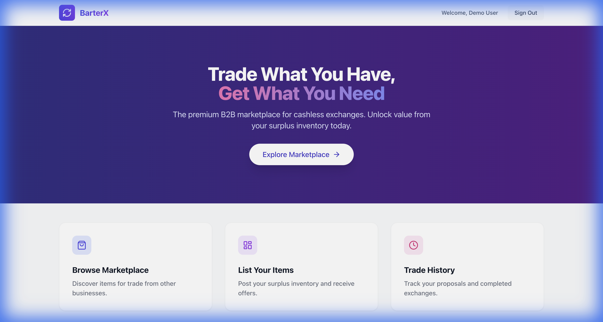 | 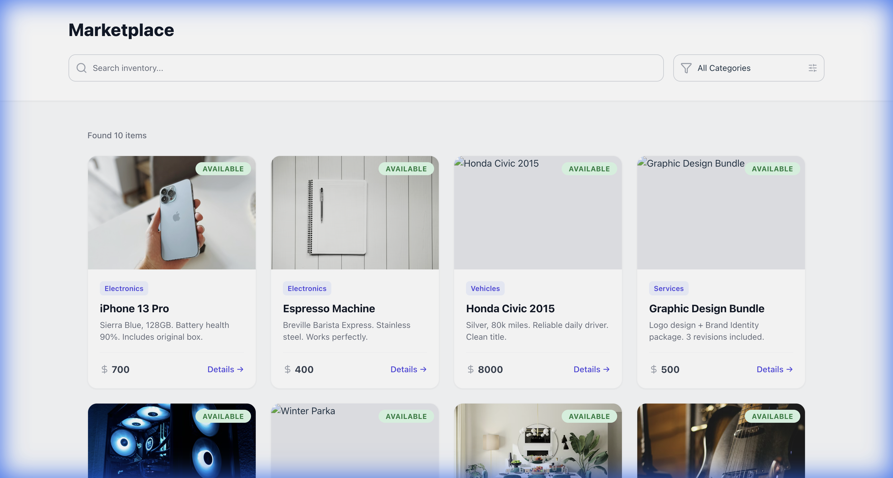 |

| Login | Register |
|:---:|:---:|
| 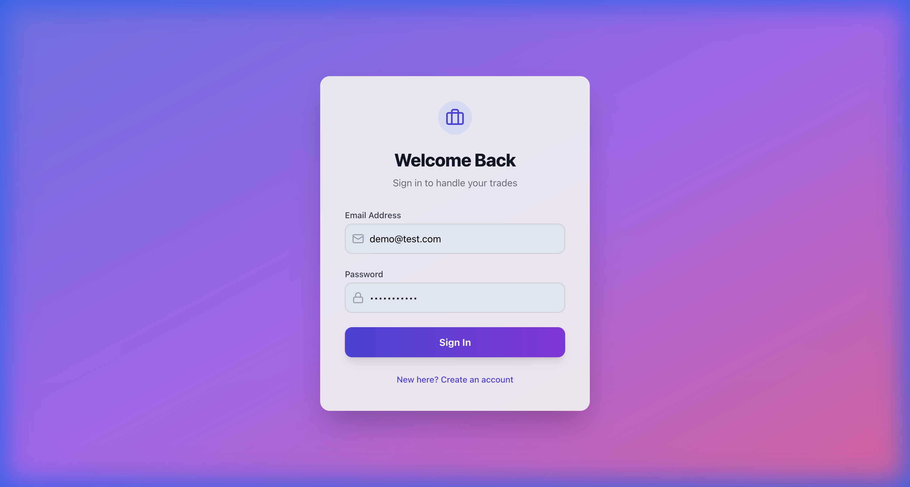 | 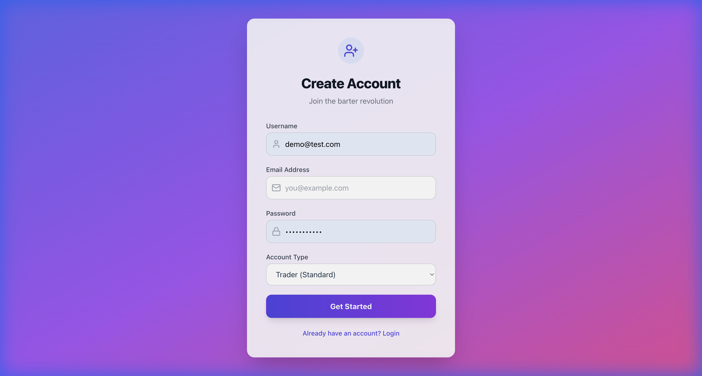 |

| Listing Details | Create Listing |
|:---:|:---:|
| 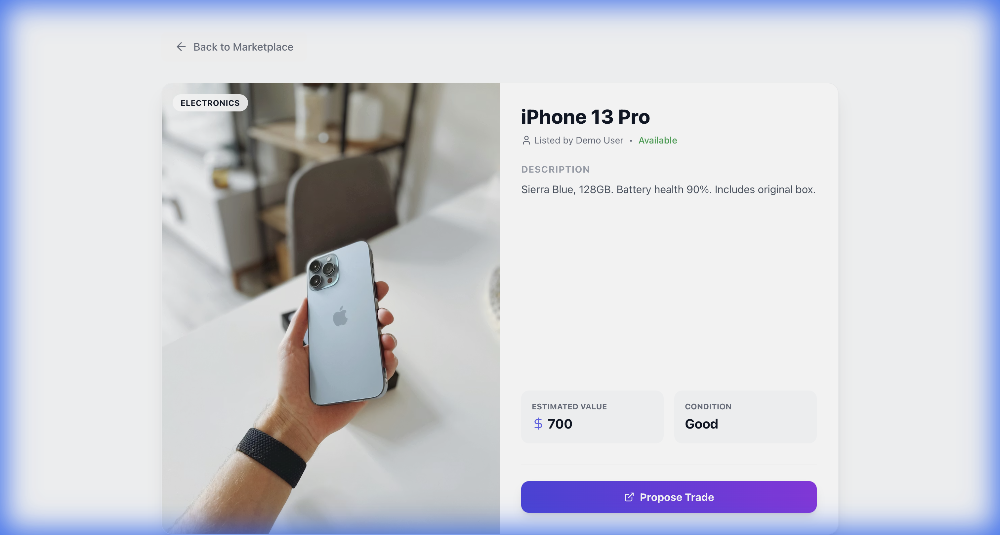 | 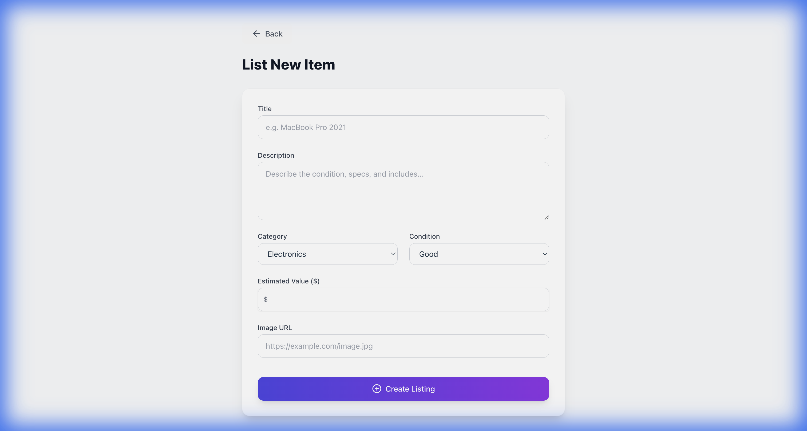 |


## 🛠 Tech Stack

- **Frontend**: React.js, Vite, Tailwind CSS, Context API.
- **Backend**: Node.js, Express.js.
- **Database**: MongoDB (Mongoose ODM).
- **Validation**: Joi (Server-side).

## 🏗 System Architecture

The application follows a standard **MERN Stack (3-Tier)** architecture:

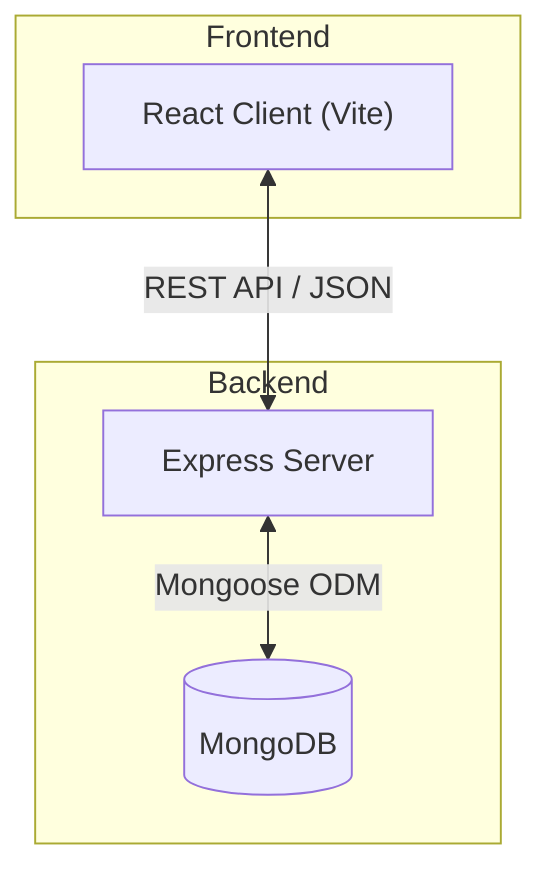

## 📚 Documentation

### 1. Software Requirements Specification (SRS)
#### 1.1 Purpose
The purpose of this document is to define the requirements for the B2B Barter Exchange Portal, a web-based marketplace allowing businesses to list surplus inventory and exchange goods or services without direct monetary transactions.

#### 1.2 Scope
The application will be a full-stack web application using the MERN stack (MongoDB, Express.js, React.js, Node.js). It will facilitate user registration, inventory listing, trade proposal creation, and transaction history tracking.

#### 2. General Description
**Product Perspective**: This is a standalone web application accessible via modern web browsers. It consists of a React.js frontend and a Node.js/Express.js backend connecting to a MongoDB database.

**User Classes**:
- **Guest**: Can view public listings.
- **Registered Business User**: Can list items, propose trades, and view history.
- **Admin**: Can manage users, moderate listings, and resolve disputes.

#### 3. Functional Requirements
**Authentication & Authorization**:
- **Registration/Login**: Users can sign up and log in using email/password.
- **JWT Authentication**: Secure stateless authentication using JSON Web Tokens.
- **RBAC**: Middleware to differentiate between 'User' and 'Admin' roles.

**Inventory Management**:
- **Create Listing**: Users can add items with details (title, description, category, value, images).
- **Read Listings**: Paginated view of available items with text search.
- **Update/Delete**: Full CRUD capabilities for item owners.

**Trade/Exchange Mechanism**:
- **Propose Trade**: User A proposes an item in exchange for User B's item.
- **Trade Lifecycle**: `Pending` → `Accepted` → `Completed`.

**Transaction History**:
- **Logs**: Immutable record of completed trades.
- **Dashboard**: View past trades and active proposals.

#### 4. Non-Functional Requirements
- **Performance**: Server-side pagination, React code-splitting.
- **Security**: Bcrypt password hashing, Joi input validation, Helmet for security headers.
- **Usability**: Responsive design with Tailwind CSS.

---

### 2. System Design Document (SDD)

#### System Architecture
The system follows a classic **3-Tier Architecture** (MERN Stack).

**1. Presentation Layer (Client)**: React.js SPA handling UI and API consumption.
**2. Application Layer (Server)**: Node.js + Express.js handling business logic and routing.
**3. Data Layer (Database)**: MongoDB storing JSON-like documents.

#### Database Schema Design
**Users Collection**
- `username`, `email` (Unique)
- `passwordHash` (Bcrypt)
- `role` ('user', 'admin')

**Listings Collection**
- `owner` (Ref: User)
- `title`, `description`, `category`
- `status` ('available', 'pending', 'traded')
- `images` (Array of URLs)

**Trades Collection**
- `initiator`, `receiver` (Ref: User)
- `listingInitiator`, `listingReceiver` (Ref: Listing)
- `status` ('pending', 'accepted', 'rejected', 'completed', 'cancelled')
- `message` (String)

#### API Design (RESTful)
**Auth Routes**
- `POST /api/auth/register`
- `POST /api/auth/login`
- `GET /api/auth/me`

**Listing Routes**
- `POST /api/listings` (Create)
- `GET /api/listings` (Read All)
- `GET /api/listings/:id` (Read One)
- `PUT /api/listings/:id` (Update)
- `DELETE /api/listings/:id` (Delete)

**Trade Routes**
- `POST /api/trades` (Propose)
- `GET /api/trades/history` (View History)
- `PUT /api/trades/:id/:action` (Accept/Reject/Cancel)

#### Security Strategy
- **JWT**: Stateless session management.
- **Validation**: Joi middleware for rigorous input checking.
- **Indexing**: Text indexes on listing titles for performant search.

## 📊 Engineering Diagrams

### 1. Unified Modeling Language (UML) Diagrams

#### Use Case Diagram
Visualizes the interactions between actors (Users, Admins) and the system.

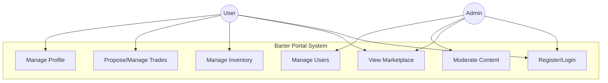

#### Sequence Diagram (Trade Lifecycle)
Details the step-by-step flow of a trade proposal and acceptance.

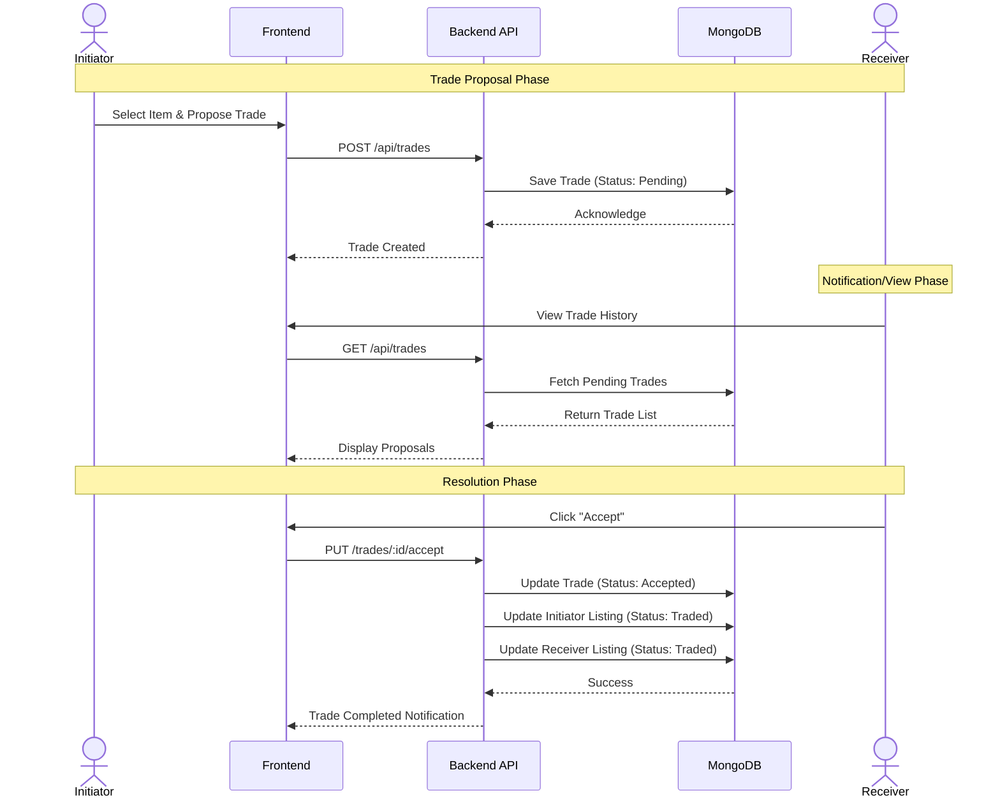

### 2. Data Models & Flow

#### Entity Relationship Diagram (ERD)
Illustrates the schema relationships between Users, Listings, and Trades.

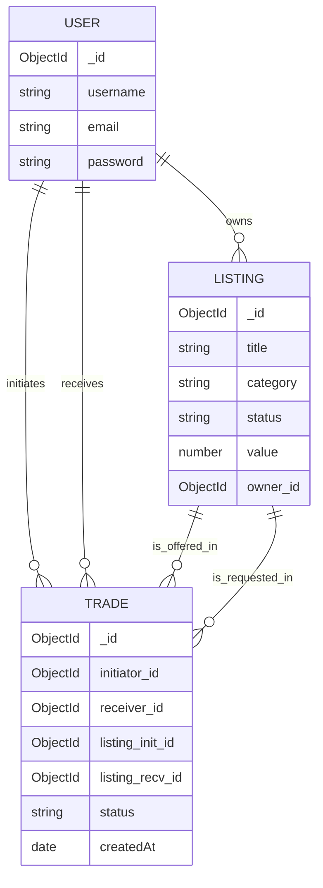

#### Data Flow Diagram (DFD Level 0)
Shows the high-level flow of data through the system.

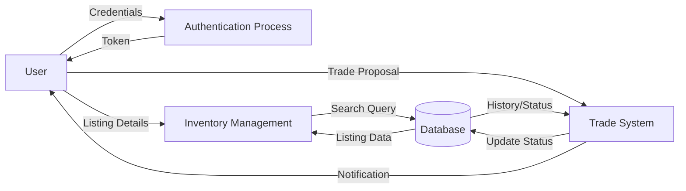

## 📦 Installation & Run

### Prerequisites
- Node.js (v14+)
- MongoDB (Running locally or a Cloud URI)

### 1. Backend Setup
```bash
cd server
npm install
# Create a .env file based on strict requirements or use default:
# PORT=5000
# MONGO_URI=mongodb://localhost:27017/barter-app
# JWT_SECRET=your_secret_key
npm run dev
```

### 2. Frontend Setup
```bash
cd client
npm install
npm run dev
```

## 🤝 Contributing
Self-project for portfolio/learning purposes.

## 📄 License
MIT
