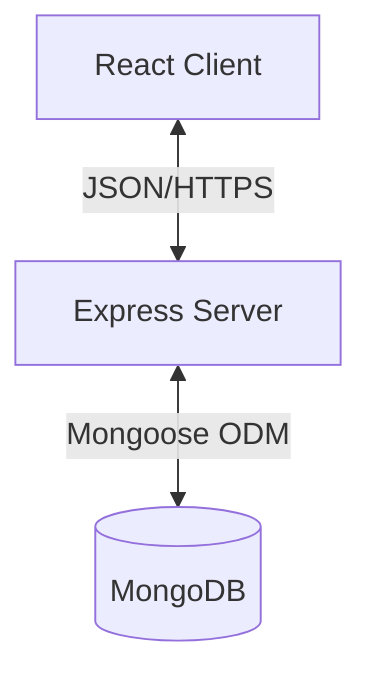

# Software Design Document (SDD)
## B2B Barter Exchange Portal

### 1. System Architecture
The system follows a classic **3-Tier Architecture** (MERN Stack):

1.  **Presentation Layer (Client)**: React.js SPA (Single Page Application). Handles UI, user interaction, and API consumption.
2.  **Application Layer (Server)**: Node.js + Express.js. Handles business logic, authentication, and REST API routing.
3.  **Data Layer (Database)**: MongoDB. Stores JSON-like documents for users, products, and transactions.

### 2. Database Schema Design
We will use Mongoose schemas to define the data models.

#### 2.1 Users Collection
Stores user profile and authentication info.
- `_id`: ObjectId
- `username`: String (Unique)
- `email`: String (Unique)
- `passwordHash`: String (Bcrypt)
- `role`: Enum ['user', 'admin']
- `createdAt`: Date

#### 2.2 Listings Collection
Represents items available for trade.
- `_id`: ObjectId
- `owner`: ObjectId (Ref: User)
- `title`: String
- `description`: String
- `category`: String
- `estimatedValue`: Number
- `status`: Enum ['available', 'pending', 'traded']
- `images`: [String] (URLs)
- `createdAt`: Date

#### 2.3 Transactions/Trades Collection
Tracks trade proposals and their statuses.
- `_id`: ObjectId
- `initiator`: ObjectId (Ref: User)
- `receiver`: ObjectId (Ref: User)
- `offeredItems`: [ObjectId] (Ref: Listing)
- `requestedItems`: [ObjectId] (Ref: Listing)
- `status`: Enum ['pending', 'accepted', 'rejected', 'completed', 'cancelled']
- `messages`: Array of objects (simple chat/notes)
- `updatedAt`: Date

### 3. API Design (RESTful)

#### 3.1 Auth Routes
- `POST /api/auth/register` - Register new user
- `POST /api/auth/login` - Login and receive JWT
- `GET /api/auth/me` - Get current user profile (Protected)

#### 3.2 Listing Routes
- `POST /api/listings` - Create a new listing (Protected)
- `GET /api/listings` - Get all listings (Pagination, Filters)
- `GET /api/listings/:id` - Get specific listing details
- `PUT /api/listings/:id` - Update listing (Owner only)
- `DELETE /api/listings/:id` - Delete listing (Owner only)

#### 3.3 Trade Routes
- `POST /api/trades` - Propose a new trade (Protected)
- `GET /api/trades` - Get user's trades (History/Pending)
- `PUT /api/trades/:id/status` - Accept/Reject/Cancel trade

### 4. Component Design (Frontend)

#### 4.1 Key Page Components
- `LoginPage`, `RegisterPage`: Auth forms.
- `Dashboard`: Overview of user's listings and active trades.
- `Marketplace`: Grid view of all active listings with search.
- `ListingDetails`: Single item view with "Propose Trade" button.
- `TradeHistory`: List of past and current trades.

#### 4.2 Reusable Components
- `Navbar`: Navigation and user state.
- `ListingCard`: Thumbnail view of an item.
- `PaginationControl`: For navigating lists.
- `ProtectedRoute`: HOC to guard routes requiring login.
- `StatusBadge`: Visual indicator for trade/item status.

### 5. Security & Performance Strategy
- **JWT Handling**: Stored in `localStorage` or `HttpOnly` cookies (MVP: localStorage).
- **Validation**: Joi middleware for all `POST/PUT` bodies.
- **Indexing**: MongoDB Text index on `title` and `description` for search. Compound index on `status` and `createdAt` for listing queries.
